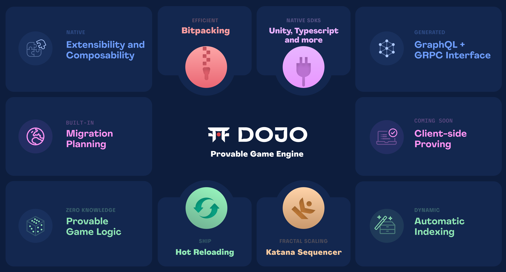

# Dojo: Provable Game Engine  [![Telegram Chat][tg-badge]][tg-url] ![Github Actions][gha-badge]

[gha-badge]: https://img.shields.io/github/actions/workflow/status/dojoengine/dojo/ci.yml?branch=main
[tg-badge]: https://img.shields.io/endpoint?color=neon&logo=telegram&label=chat&style=flat-square&url=https%3A%2F%2Ftg.sumanjay.workers.dev%2Fdojoengine
[tg-url]: https://t.me/dojoengine

Dojo provides a developer friendly framework for developing and scaling onchain games and autonomous worlds that are composable, extensible, permissionless and persistent. We do so by providing a ~zero-cost abstraction for developers to succinctly define their onchain world using [Cairo](https://github.com/starkware-libs/cairo) and a robust toolchain for building, migrating, deploying, proving and settling these worlds in production. Leveraging execution sharding and fractal scaling, we're able to scale computation to meet the needs of complex, interactive experiences, while maintaining the security properties of Ethereum.

## 🚀 Quick Start

See the [installation guide](https://book.dojoengine.org/getting-started/quick-start) in the Dojo book.

## ⛩️ Built with Dojo

- [Awesome Dojo](https://github.com/dojoengine/awesome-dojo)
- [Origami](https://github.com/dojoengine/origami)

## 🗒️ Documentation

You can find more detailed documentation in the Dojo Book [here](https://book.dojoengine.org/).

## ❓ Support

If you encounter issues or have questions, you can [submit an issue on GitHub](https://github.com/dojoengine/dojo/issues). You can also join our [Discord](https://discord.gg/PwDa2mKhR4) for discussion and help.

## 🏗️ Contributing

We welcome contributions of all kinds from anyone. See our [Contribution Guide](/CONTRIBUTING.md) for more information on how to get involved.

## ✏️ Environment

See our [Environment setup](https://book.dojoengine.org/getting-started) for more information.

## Releasing

Propose a new release by manually triggering the `release-dispatch` github action. The version value can be an semver or a level: `[patch, minor, major]`.

Once run, the workflow will create a PR with the versioned repo which will trigger the release flow and the creation of a draft release on merge.
