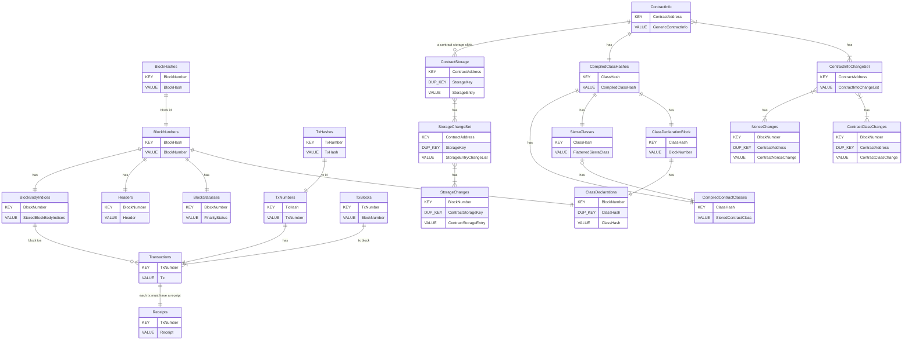

# Database

## Table layout

```mermaid
erDiagram

Headers {
    KEY BlockNumber
    VALUE Header 
}

BlockHashes {
    KEY BlockNumber
    VALUE BlockHash
}

BlockNumbers {
    KEY BlockHash
    VALUE BlockNumber
}

BlockStatusses {
    KEY BlockNumber
    VALUE FinalityStatus
}

BlockBodyIndices {
    KEY BlockNumber
    VALUE StoredBlockBodyIndices
}

TxNumbers {
    KEY TxHash
    VALUE TxNumber
}

TxHashes {
    KEY TxNumber
    VALUE TxHash
}

Transactions {
    KEY TxNumber
    VALUE Tx
}

TxBlocks {
    KEY TxNumber
    VALUE BlockNumber
}

Receipts {
    KEY TxNumber
    VALUE Receipt
}

CompiledClassHashes {
    KEY ClassHash
    VALUE CompiledClassHash
}

CompiledContractClasses {
    KEY ClassHash
    VALUE StoredContractClass
}

SierraClasses {
    KEY ClassHash
    VALUE FlattenedSierraClass
}

ContractInfo {
    KEY ContractAddress
    VALUE GenericContractInfo
}

ContractStorage {
    KEY ContractAddress
    DUP_KEY StorageKey
    VALUE StorageEntry
}

ClassDeclarationBlock {
    KEY ClassHash
    VALUE BlockNumber
}

ClassDeclarations {
    KEY BlockNumber
    DUP_KEY ClassHash
    VALUE ClassHash
}

ContractInfoChangeSet {
    KEY ContractAddress
    VALUE ContractInfoChangeList
}

NonceChanges {
    KEY BlockNumber
    DUP_KEY ContractAddress
    VALUE ContractNonceChange
}

ContractClassChanges {
    KEY BlockNumber
    DUP_KEY ContractAddress
    VALUE ContractClassChange
}

StorageChangeSet {
    KEY ContractAddress
    DUP_KEY StorageKey
    VALUE StorageEntryChangeList
}

StorageChanges {
    KEY BlockNumber
    DUP_KEY ContractStorageKey
    VALUE ContractStorageEntry
}


BlockHashes ||--|| BlockNumbers : "block id"
BlockNumbers ||--|| BlockBodyIndices : "has"
BlockNumbers ||--|| Headers : "has"
BlockNumbers ||--|| BlockStatusses : "has"

BlockBodyIndices ||--o{ Transactions : "block txs"

TxHashes ||--|| TxNumbers : "tx id"
TxNumbers ||--|| Transactions : "has"
TxBlocks ||--|{ Transactions : "tx block"
Transactions ||--|| Receipts : "each tx must have a receipt"

CompiledClassHashes ||--|| CompiledContractClasses : "has"
CompiledClassHashes ||--|| SierraClasses : "has"
SierraClasses |o--|| CompiledContractClasses : "has"

ContractInfo ||--o{ ContractStorage : "a contract storage slots"
ContractInfo ||--|| CompiledClassHashes : "has"

ContractInfo }|--|{ ContractInfoChangeSet : "has"
ContractStorage }|--|{ StorageChangeSet : "has"
ContractInfoChangeSet }|--|{ NonceChanges : "has"
ContractInfoChangeSet }|--|{ ContractClassChanges : "has"
CompiledClassHashes ||--|| ClassDeclarationBlock : "has"
ClassDeclarationBlock ||--|| ClassDeclarations : "has"
BlockNumbers ||--|| ClassDeclarations : ""
StorageChangeSet }|--|{ StorageChanges : "has"

```