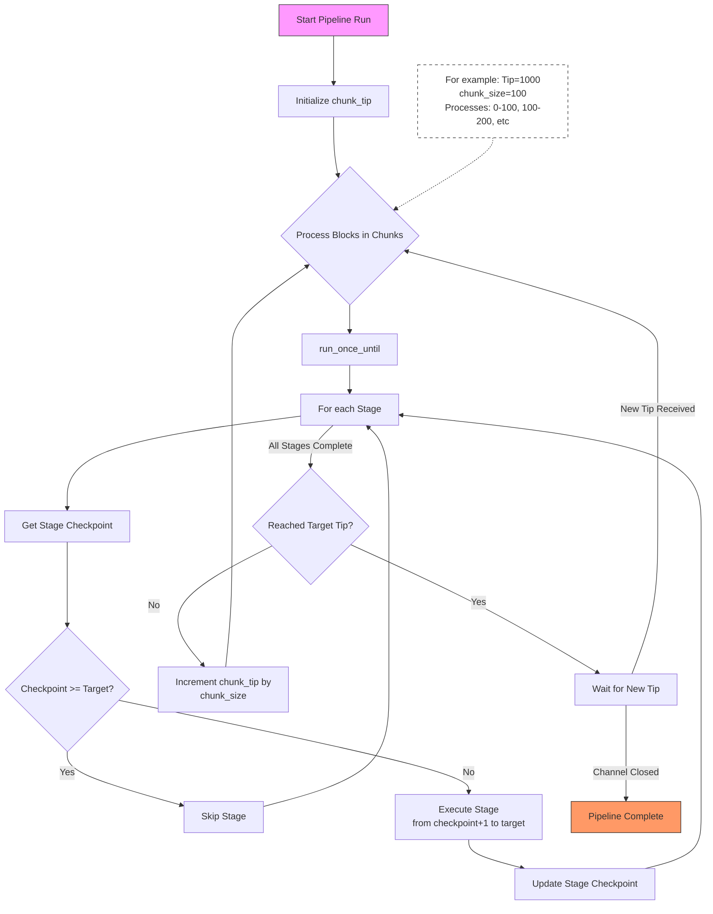

# Syncing pipeline

```mermaid
flowchart TD
    A[Start Pipeline Run] --> B[Initialize chunk_tip]

    B --> D{Process Blocks in Chunks}
    D --> E[run_once_until]

    %% run_once_until subflow
    E --> S1[For each Stage]
    S1 --> S2[Get Stage Checkpoint]
    S2 --> S3{Checkpoint >= Target?}
    S3 -->|Yes| S4[Skip Stage]
    S3 -->|No| S5[Execute Stage<br>from checkpoint+1 to target]
    S5 --> S6[Update Stage Checkpoint]
    S6 --> S1
    S4 --> S1

    S1 -->|All Stages Complete| F{Reached Target Tip?}
    F -->|No| G[Increment chunk_tip by<br>chunk_size]
    G --> D

    F -->|Yes| H[Wait for New Tip]
    H -->|New Tip Received| D
    H -->|Channel Closed| I[Pipeline Complete]

    style A fill:#f9f,stroke:#333
    style I fill:#f96,stroke:#333

%% Example annotations
    classDef note fill:#fff,stroke:#333,stroke-dasharray: 5 5
    N1[For example: Tip=1000<br>chunk_size=100<br>Processes: 0-100, 100-200, etc]:::note
    N1 -.-> D
```
